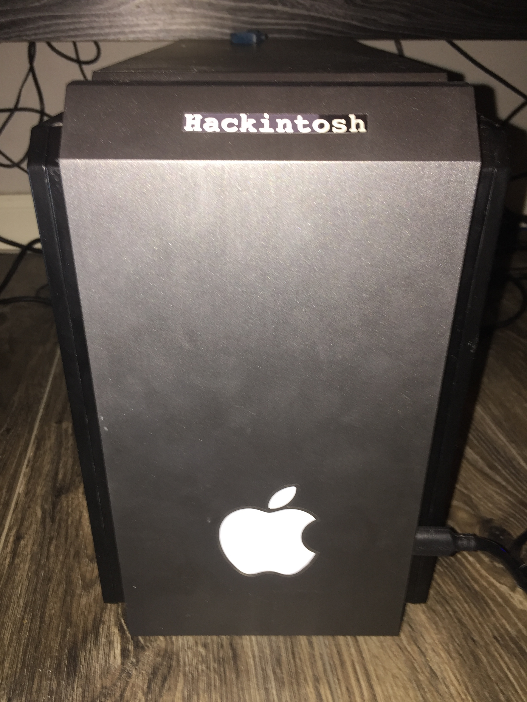
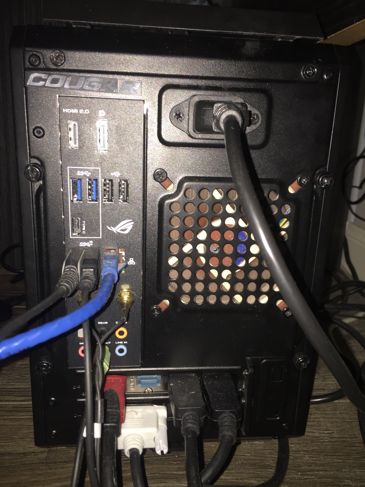
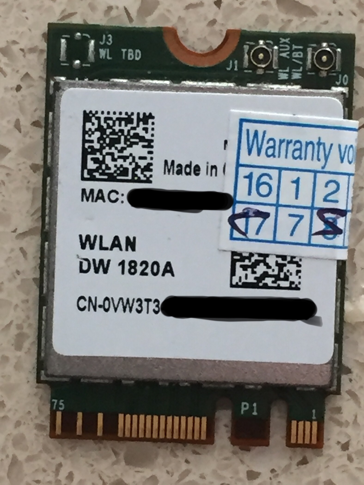
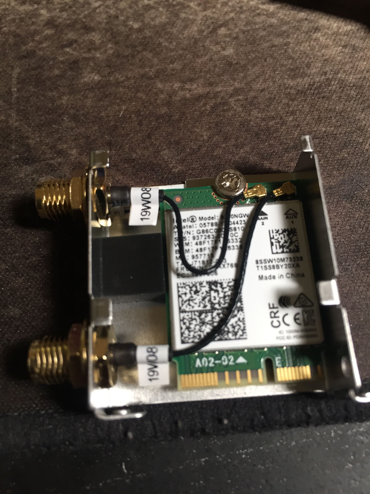

# EFI for Hackintosh on ASUS ROG Z390-I Gaming / AMD RX 580 GPU / 1820A Wifi

Everything is working on Catalina with both Clover and OpenCore
- You need to generate your own UUID/Serial #will add how soon#
- The opencore EFI works with Big Sur, including WIFI/Bluetooth. But not continuity.

## Hardware

- COUGAR QBX Black Mini-ITX Ultra-Compact Pro Gaming Case
- ASUS ROG Z390-I Gaming
- Inter Core i7-9700K
- Radeon Shapphie Pulse RX 580
- Dell VW3T3 WLAN DW 1820A Wifi (onboard replacement)
- 2 x Crucial Ballistix Sport LT 3000 MHz DDR4 DRAM 8GB
- Samsung 970 EVO NVMe M.2 SSD 1TB / Samsung 850 EVO NAND SSD 500G / Crucial MX300 280GB
- Corsaire SF 450 / SFX to ATX Power supply adapter
- CPU Fan - NH-U9S - Only one that can cool down that CPU in that small case
- Case Fan - NF-A9
- 3 Dell Monitor (2DP + DVI) + HDMI to TV

COUGAR QBX Case Photos

Build Photos

Dell VW3T3 WLAN DW 1820A Wifi onboard replacement

## What works

All of Continuity

Service detail

- Handoff
- iMessage
- Continuity Camera
- Universal Clipboard
- Instant Hotspot
- Air Drop
- iPhone Cellular Calls
- Auto Unlock
- Apple Pay

- Sleep (fans and RGB LEDs included)
- Power Nap (sleep with background operations such as Time Machine)
- Wake
- Audio (select internal speakers)
- Ethernet - Bluetooth - WiFi
- All USB and USB 3.1 ports - Port mapping for the case
- Nightshift (no kexts required)

## USBMap

My case has 2 front USB 3.1 Gen 1 and I'm not using usb c.
With the 15 ports limit, here what I chose:

| Ports | Type | Description |
| --- | --- | --- |
| HS03 | USB 2 Standard-A connector | Rear USB 3.1 Gen 2 (red) |
| HS04 | USB 2 Standard-A connector | Rear USB 3.1 Gen 2 (red) |
| HS06 | USB 2 Standard-A connector | Rear USB 2.0 (black) |
| HS07 | USB 2 Standard-A connector | Rear USB 3.1 Gen 1 (blue) |
| HS08 | USB 2 Standard-A connector | Rear USB 3.1 Gen 1 (blue) |
| HS09 | USB 2 Standard-A connector | Front USB 3.1 Gen 1 |
| HS10 | USB 2 Standard-A connector | Front USB 3.1 Gen 1 |
| HS13 | Internal connector | Aura Motherboard |
| HS14 | Internal connector | Bluetooth/Wifi - DELL DW1820 (BCM4350) 802.11ac |
| SS03 | USB 3 Standard-A connector | Rear USB 3.1 Gen 2 (red) |
| SS04 | USB 3 Standard-A connector | Rear USB 3.1 Gen 2 (red) |
| SS07 | USB 3 Standard-A connector | Rear USB 3.1 Gen 1 (blue) |
| SS08 | USB 3 Standard-A connector | Rear USB 3.1 Gen 1 (blue) |
| SS09 | USB 3 Standard-A connector | Front USB 3.1 Gen 1 |
| SS10 | USB 3 Standard-A connector | Front USB 3.1 Gen 1 |

